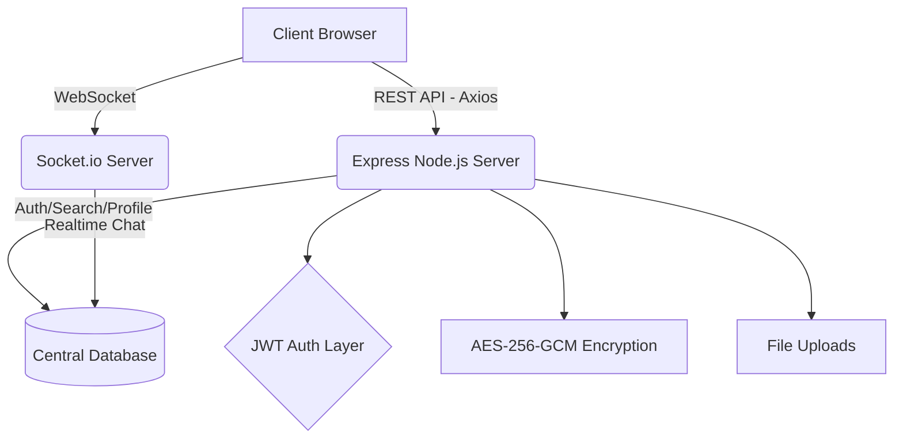

<div align="center">
  <h1>💍 Vivah Bandhan (SoulBound)</h1>
  <h3>High-Trust, Real-Time Matchmaking Platform</h3>
  <p><b>Executive System Design & Architecture Documentation</b></p>
</div>

---

## 📑 Executive Summary

**Vivah Bandhan** (codenamed *SoulBound*) is a next-generation matrimonial and matchmaking platform engineered for high privacy, absolute security, and real-time interaction. Designed to scale seamlessly, the architecture segregates concerns into a lightweight React-based client and a robust, high-performance Node.js backend. 

This platform prioritizes user safety and data integrity through features like **end-to-end PII encryption**, inherent **Interest Gating**, **Canvas-based Photo Watermarking**, and **Automated Community Moderation (Shadow-Banning)**.

---

## 🏛 System Architecture

The platform follows a decoupled **Client-Server Architecture** utilizing specialized subsystems for diverse operations (HTTP vs WebSocket traffic).



### Core Technologies
- **Frontend Layer**: React 19, TypeScript, Vite, React Router DOM (v7). Designed as a highly responsive Single Page Application (SPA).
- **Backend/API Layer**: Node.js (v18+), Express.js, TypeScript.
- **Real-Time Communication**: WebSockets via `Socket.io` (v4). 
- **Database Engine**: `better-sqlite3` utilizing a proprietary adapter (`pgToSqlite`) to execute PostgreSQL-styled parameterized queries, allowing zero-friction migration to managed PostgreSQL clusters (like AWS RDS) in the future.

---

## 🔐 Security & Privacy Framework

Security is treated as a first-class paradigm rather than an afterthought.

| Security Pillar | Implementation Details |
| :--- | :--- |
| **Data At Rest (PII)** | Advanced **AES-256-GCM** encryption for highly sensitive identifiers (Govt IDs, phone numbers). |
| **Photo Protection** | Canvas-based overlay actively stamps the *viewer's* User ID onto images to deter unauthorized distribution. |
| **Zero-Spam Messaging** | **Interest Gating**: The Socket.io chat server rejects cross-communication unless `status='accepted'` exists natively in the database. |
| **Granular Visibility** | Multi-tier privacy contexts (`public`, `registered_only`, `accepted_only`) managed strictly at the database query level. |
| **Automated Moderation** | Threshold-based **Shadow Banning** built around user reported toxicity scores. |

---

## 🗄 Database Models & Schema Design

The relational structure is optimized for normalized data storage and heavily indexed for fast read operations querying 15+ complex filters concurrently.

### 1. `users` & `profiles`
The master record for authentication and platform-wide presence, joined 1:1 with `profiles`.
- **`users`**: Manages `email`, `password_hash`, `trust_score`, and active `status`.
- **`profiles`**: High-availability read model containing `dob`, `religion`, `education`, `lifestyle_diet`, and `annual_income`.

### 2. `privacy_settings` & `partner_preferences`
- **Privacy Engine**: Governs `photo_visibility` and `contact_visibility`. Includes the **"Ghost Mode"** (`is_hidden` toggle) which removes the profile from the aggregate query builder.
- **Match Engine Engine**: Stores defined acceptable boundaries (e.g., `age_min`, `height_min_cm`, `manglik` preferences) used by the Daily AI-suggested match algorithm.

### 3. `interests` & `messages`
- **Edges & Connectivity**: 
  - `interests` serves as the directed graph of user relations (`sender_id`, `receiver_id`, `status: pending/accepted/rejected`).
  - `messages` acts as the persistent store for the encrypted Socket.io real-time chat service.

---

## 🛠 Flow Mechanics

### 1. Search Engine (`search.ts`)
The discovery engine allows users to query over **15 dynamic variables**. The query builder intelligently drops `NULL` clauses and constructs complex SQLite/PostgreSQL `WHERE` permutations to ensure response times remain sub-50ms even with broad geographic and demographic criteria. 

### 2. Real-Time Chat Engine (`chat.ts` + Socket.io)
1. User connects via WebSocket presenting a valid JWT signature.
2. Server validates the signature and maps the JWT `userId` to the physical `socket.id`.
3. Before emitting an event, the system polls the `interests` table ensuring mutual consent.
4. On success, the payload is hashed, stored in DB, and pushed selectively to the connected client.

---

## 🚀 Rapid Development & Operations

### Prerequisites
- **Node.js**: v18.0.0 or higher
- **Local Dev**: Zero dependencies required; SQLite database (`data/vivah.db`) auto-generates on launch.

### Bootstrapping the Services

#### 1. Setup Environment
```bash
cd backend
copy .env.example .env
# Ensure JWT_SECRET is safely configured.
```

#### 2. Launch Backend API
```bash
npm install
npm run dev
# The backend instances will self-initialize the Database Schema on port 5000
```

#### 3. Launch Frontend Client
```bash
cd ../frontend
npm install
npm run dev
# The Vite server will launch hot-module replacement on port 5173
```

---

*Confidential & Proprietary. Architecture designed for absolute scalability, data sovereignty, and high-trust matchmaking operations.*
